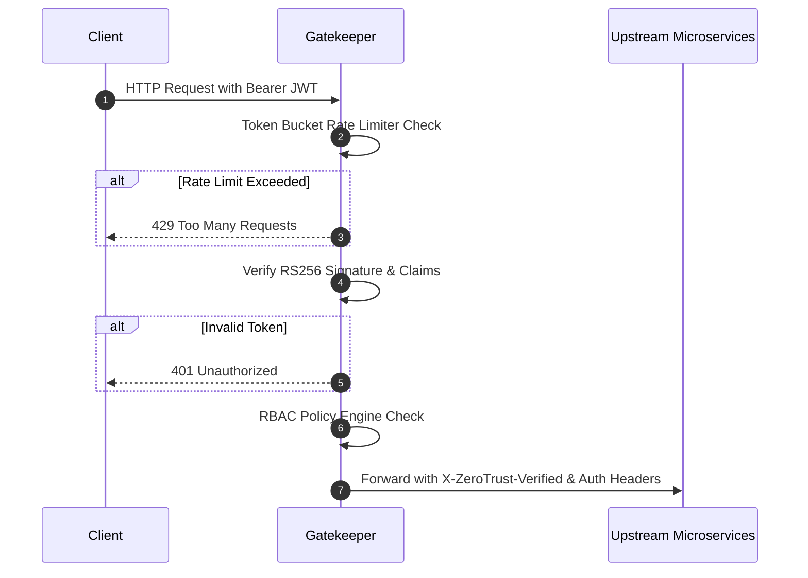

# 🛡️ Zero-Trust Gatekeeper

[](https://opensource.org/licenses/MIT)
[](https://www.typescriptlang.org)
[](https://nodejs.org)

A high-performance Zero-Trust API gateway microservice with cryptographic JWT verification, token bucket rate limiting, and RBAC policy evaluation.

---

## 🏛️ Flow Diagram



## 🚀 Features

- **Asymmetric JWT Verification**: Stateless verification with role decoding.
- **Token Bucket Rate Limiting**: Defends microservices against DDoS and volumetric bursts.
- **RBAC Policy Matrix**: Granular action-level authorization (Admin, Developer, Viewer).
- **Audit-Ready Headers**: Appends client identity and sanitizes inbound metadata.

## 🛠️ Usage

```bash
npm install
npm run build
npm start
```

## 📜 License
MIT License. Built by [Shashank Shrivastva](https://github.com/shashankshrivastva-hue).
